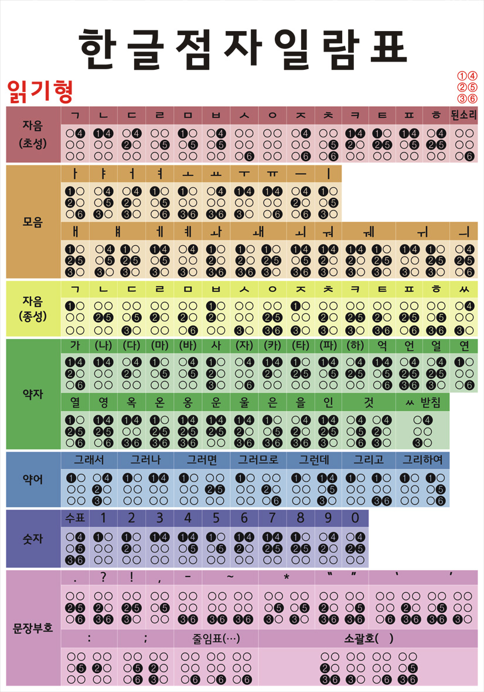
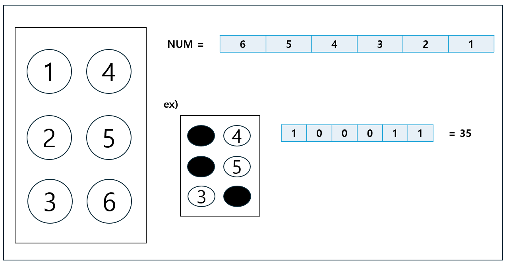

# Capstone-Project
시각장애인을 위한 점자를 인식하고 음성으로 추출하는 프로그램

# 연구 팀원
+ 상명대학교 김광민
+ 상명대학교 김예빈
+ 상명대학교 이준형
+ 상명대학교 채민석

# 점자

|종류|개수|
|------|---:|
|자음(초성)|15|
|모음|22|
|자음(종성)|15|
|약자|27|
|약어|7|
|숫자|11|
|문장부호|16|
|총합|113|

# 점자 넘버링

# 계획
1.이미지 전처리(필터링)

2.점자 인식기(인공신경망 딥러닝학습)

3.문자 해석기(문자합성 + 문장 검사)

4.음성 출력기
